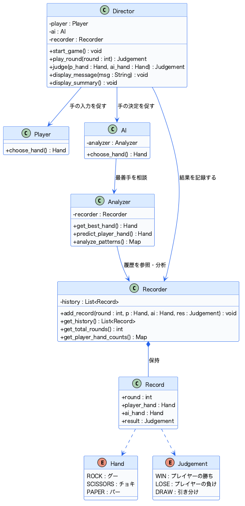
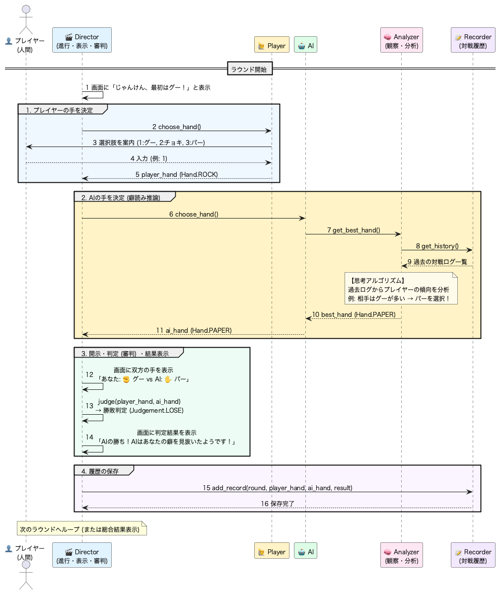

# ✊✌️✋ AIじゃんけんシステム 設計仕様書

文化祭の展示・出し物に向けた、**「対戦相手の癖を分析して進化する適応型AIじゃんけん」**のソフトウェア設計書です。

いきなりコードを書き始めるのではなく、**「オブジェクト指向（責務の分離）」**と**「UML（統一モデリング言語）」**を用いて、拡張性が高く美しいアーキテクチャを設計しています。

> 📄 **PDF版のダウンロード**: [AI_Janken_Design_Document.pdf](docs/AI_Janken_Design_Document.pdf)（スマホでの閲覧・LINE共有に最適化されています）

---

## 📌 1. システム概要 & コンセプト

### コンセプト
* **最初は手加減、だんだん強くなるAI**:
  初めはランダムに手を出しますが、対戦を重ねるにつれて「プレイヤーが出しやすい手の癖」や「勝敗後の行動パターン」を学習・分析し、裏をかく手を打つようになります。
* **文化祭での盛り上がりポイント**:
  「AIがあなたの癖を分析中……」「分析完了！あなたの最頻手はチョキですね！」などの分析データを画面に開示することで、体験者に驚きと楽しさを提供します。

### 設計方針（単一責任の原則: Separation of Concerns）
1つの巨大なファイル（神クラス）にすべてを書くのではなく、役割ごとに明確なモジュール（クラス）に分割します。
これにより、後から「AIの頭脳だけを賢くする」「画面をカッコよくする」といった改良が安全かつ簡単に行えます。

---

## 🏛️ 2. アーキテクチャ & モジュール一覧

本システムは以下の **5つのコアモジュール** で構成されます。

| モジュール名 | 役割（責務） | 詳細説明 |
| :--- | :--- | :--- |
| **`Director`** | 司令塔・進行・表示・審判 | ゲームループ全体の進行管理、コンソールへのメッセージ出力、およびルールに従った勝敗判定を行うマスターモジュール。いわゆる `main` を司る。 |
| **`Player`** | プレイヤー入力管理 | 人間（ユーザー）から手の入力を受け付け、有効な手（グー・チョキ・パー）として確定させる。 |
| **`AI`** | AIプレイヤー管理 | 対戦相手となるAIの手出しを管理する。実際の手の決定は `Analyzer` に相談する。 |
| **`Analyzer`** | 癖の観察・分析・推論エンジン | `Recorder` の対戦ログを解析し、相手の癖を見抜いて最善手を算出するAIの「頭脳」。 |
| **`Recorder`** | 対戦履歴データベース | 各ラウンドの「プレイヤーの手」「AIの手」「勝敗結果」を時系列ログとして保存・蓄積する。 |

---

## 📊 3. クラス構造図（Class Diagram）

システムを構成するクラスと、その間の依存・集約関係を示した構造図です。

  

### 設計の注目ポイント
* **Director の集約**: `Player`, `AI`, `Recorder` を所有し、ゲーム全体をコントロールします。
* **Strategy パターン**: `AI` は思考ロジックを直接持たず、`Analyzer` に委譲しています。これにより、AI本体のコードを変えずに「賢さのアルゴリズム」だけを自由自在に差し替えることができます。

---

## 🔄 4. 処理の流れ：シーケンス図（Sequence Diagram）

1回のじゃんけん（1ラウンド）の中で、各オブジェクトがどのようにメッセージをやりとりするかを表した図です。

  

### 処理サイクルのポイント
1. `Director` が進行役となり、プレイヤーとAIの双方から手を集めます。
2. `AI` は `Analyzer` に最善手を尋ね、`Analyzer` は `Recorder` の過去戦績から手を推論します。
3. `Director` が審判として勝敗を判定・表示し、結果を `Recorder` に保存して次のラウンドへ繋ぎます。

---

## 🧠 5. 思考エンジン（Analyzer）の進化ステップ

文化祭に向けて、段階的にAIの賢さをアップデートしていきましょう！

* **Lv.1 序盤（3戦未満: データ収集期）**:
  過去データが少ないため、`random.choice()` で完全ランダムに手を出し、相手の手の内を観察します。
* **Lv.2 中盤（最頻手カウンター期）**:
  プレイヤーが最も多く出している手（例: グーが全体の50%）を集計し、その手に勝つ手（パー）を選択します。
* **Lv.3 終盤（心理・直前遷移読み期）**:
  「人間がじゃんけんで無意識にとる行動パターン（心理傾向）」を確率モデル（マルコフ連鎖）で予測します：
  * **勝った後**: 同じ手をもう一度出したくなる傾向
  * **負けた後**: 手を変えたくなり、直前に相手が勝った手を真似しやすい傾向
  * **あいこの後**: 直前と同じ手を出さず、別の手に変える傾向
* **文化祭を盛り上げる演出アイデア**:
  対戦終了後に「【AI診断レポート】あなたは追い詰められるとチョキを出す癖があります！」といった分析結果や、対戦成績のグラフを表示すると、体験者が大盛り上がりします！

---

## 🛠️ 6. 今後の開発ステップ

1. **Step 1 (基本機能)**: `Hand`, `Judgement`, `Player`, `Director` を作り、コンソールで1回勝負ができるようにする。
2. **Step 2 (データ蓄積)**: `Recorder` を作り、対戦履歴をリストで保持できるようにする。
3. **Step 3 (AI進化)**: `Analyzer` を作り、過去ログから最頻手を計算して勝つ手を出すロジックを実装する。
4. **Step 4 (展示向け演出)**: アスキーアート（AA）や絵文字による手の表示、診断サマリー表示を実装する。
