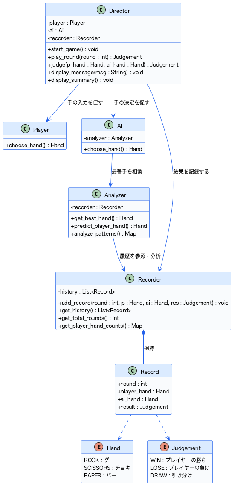
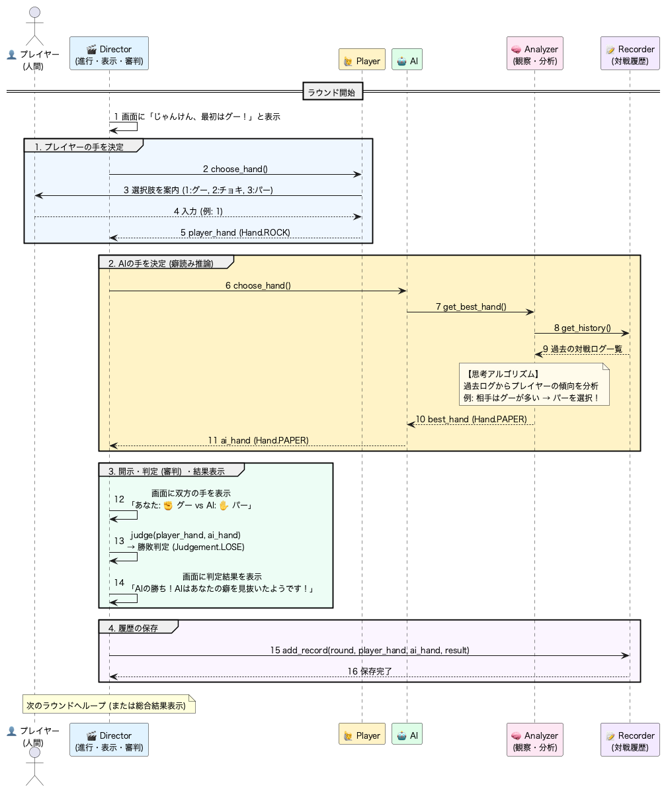

# ✊✌️✋ AIじゃんけんシステム 設計仕様書

文化祭の展示・出し物やプログラミング教室に向けた、**「対戦相手の癖を分析して進化する適応型AIじゃんけん」**のソフトウェア設計書です。

いきなりコードを書き始めるのではなく、**「オブジェクト指向（責務の分離）」**と**「UML（統一モデリング言語）」**を用いて、拡張性が高く美しいアーキテクチャを設計しています。

> 📄 **PDF版のダウンロード**: [AI_Janken_Design_Document.pdf](docs/AI_Janken_Design_Document.pdf)（スマホでの閲覧・LINE共有に最適化されています）  
> 🎮 **mBlock 5 スプライト版 実装・指導ガイド**: [HOW_TO_USE.md](HOW_TO_USE.md)

---

## 📌 1. システム概要 & コンセプト

### コンセプト
* **最初は手加減、だんだん強くなるAI**:
  初めはランダムに手を出しますが、対戦を重ねるにつれて「プレイヤーが出しやすい手の癖」や「勝敗後の行動パターン」を学習・分析し、裏をかく手を打つようになります。
* **文化祭・体験会での盛り上がりポイント**:
  「AIがあなたの癖を分析中……」「分析完了！あなたの最頻手はチョキですね！」などの分析データを画面に開示することで、体験者に驚きと楽しさを提供します。

### 設計方針（単一責任の原則: Separation of Concerns）
1つの巨大なファイル（神クラス）にすべてを書くのではなく、役割ごとに明確なモジュール（クラス）に分割します。
これにより、後から「AIの頭脳だけを賢くする」「画面をカッコよくする」といった改良が安全かつ簡単に行えます。

---

## 🏛️ 2. アーキテクチャ & モジュール一覧（論理設計）

本システムの論理設計（理想のドメインモデル）は、以下の **5つのコアモジュール** で構成されます。

| モジュール名 | 役割（責務） | 詳細説明 |
| :--- | :--- | :--- |
| **`Director`** | 司令塔・進行・表示・審判 | ゲームループ全体の進行管理、コンソールへのメッセージ出力、およびルールに従った勝敗判定を行うマスターモジュール。いわゆる `main` を司る。 |
| **`Player`** | プレイヤー入力管理 | 人間（ユーザー）から手の入力を受け付け、有効な手（グー・チョキ・パー）として確定させる。 |
| **`AI`** | AIプレイヤー管理 | 対戦相手となるAIの手出しを管理する。実際の手の決定は `Analyzer` に相談する。 |
| **`Analyzer`** | 癖の観察・分析・推論エンジン | `Recorder` の対戦ログを解析し、相手の癖を見抜いて最善手を算出するAIの「頭脳」。 |
| **`Recorder`** | 対戦履歴データベース | 各ラウンドの「プレイヤーの手」「AIの手」「勝敗結果」を時系列ログとして保存・蓄積する。 |

---

## 📊 3. クラス構造図（Class Diagram）

システムを構成するクラスと、その間の依存・集約関係を示した構造図です。

  

### 設計の注目ポイント
* **Director の集約**: `Player`, `AI`, `Recorder` を所有し、ゲーム全体をコントロールします。
* **Strategy パターン**: `AI` は思考ロジックを直接持たず、`Analyzer` に委譲しています。これにより、AI本体のコードを変えずに「賢さのアルゴリズム」だけを自由自在に差し替えることができます。

---

## 🔄 4. 処理の流れ：シーケンス図（Sequence Diagram）

1回のじゃんけん（1ラウンド）の中で、各オブジェクトがどのようにメッセージをやりとりするかを表した図です。

  

### 処理サイクルのポイント
1. `Director` が進行役となり、プレイヤーとAIの双方から手を集めます。
2. `AI` は `Analyzer` に最善手を尋ね、`Analyzer` は `Recorder` の過去戦績から手を推論します。
3. `Director` が審判として勝敗を判定・表示し、結果を `Recorder` に保存して次のラウンドへ繋ぎます。

---

## 🧠 5. 思考エンジン（Analyzer）の進化ステップ

* **Lv.1 序盤（3戦未満: データ収集期）**:
  過去データが少ないため、`random.choice()` で完全ランダムに手を出し、相手の手の内を観察します。
* **Lv.2 中盤（最頻手カウンター期）**:
  プレイヤーが最も多く出している手（例: グーが全体の50%）を集計し、その手に勝つ手（パー）を選択します。
* **Lv.3 終盤（心理・直前遷移読み期）**:
  「人間がじゃんけんで無意識にとる行動パターン（心理傾向）」を予測します（勝った後は同じ手を出しやすい、負けた後は手を変えやすいなど）。

---

## 🏗️ 6. 論理設計から物理設計（mBlock 5 実装）への適応

ソフトウェア開発では、**「理想的な論理設計（概念モデル）」**を実際の**「実行環境（ハードウェアやプラットフォーム制約）」**に合わせて落とし込む**「物理設計（実装モデル）」**のプロセスが非常に重要です。

本プロジェクトでも、生徒さんの実行環境である **mBlock 5（スプライト Python）** に移植する過程で、プラットフォーム固有の厳しい制約に直面し、アーキテクチャの大幅な適応（物理設計への最適化）を行いました。

### 🔄 新旧アーキテクチャ対比表（論理設計 vs 物理設計）

| 比較項目 | 当初の論理設計（理想モデル） | mBlock 5 での物理設計（現実適応モデル） | 適応の理由・プラットフォーム制約 |
| :--- | :--- | :--- | :--- |
| **全体構造** | 8クラス分割 （`Hand`, `Judgement`, `Record`, `Recorder`, `Analyzer`, `AI`, `Player`, `Director`） | **2大ゾーン分割 （`JankenBrain` ＋ `GameDirector`）** | mBlock プリプロセッサによる相互参照不具合の防止と、生徒さんが編集するワークスペースの保護（ゾーン制）。 |
| **画面表示 (UI)** | `Director` のメソッド内で直接 `sprite.say()` を呼ぶ | **MVC分離 （ロジックは文字列を `return`、`@event` 側で `sprite.say()`）** | `sprite.say` を含む関数が勝手にコルーチン（ジェネレータ）化され、メソッド呼び出しが素通りしてしまうバグの回避。 |
| **履歴・集計** | `Recorder` にログを蓄積し、`for` ループで集計 | **毎ターン即時カウント （`count_rock += 1` など）** | 関数内に `for` / `while` ループがあると自動的にジェネレータ化され、戻り値が `<generator object>` に化けるバグの回避。 |
| **データ構造** | 辞書リテラル `{Hand.ROCK: 0, ...}` | **個別の整数変数 （`count_rock`, `count_scissors`, ...）** | 辞書リテラルのコロン周辺に mBlock が誤って `yield makeblock.nop` を注入し構文エラーになるバグの回避。 |
| **AIへの入力** | `Analyzer` が `Recorder`（オブジェクト）を参照 | **集計済みカウント（引数）を直接渡す** | 生徒さんが安全に `if / elif` だけで最頻手判定を書けるようにするための副作用のない純粋関数化。 |

### 💡 エンジニアリングとしての教訓
1. **論理設計（What / 責務の明確化）**:
   - システム全体の「あるべき姿」や「責務の境界線」を明確にし、全体像を把握する設計図。
2. **物理設計（How / 実装の具現化）**:
   - 実行環境のバグ、パフォーマンス、プラットフォームの癖を吸収し、実際に「絶対に壊れない」形へと落とし込む職人技。
3. **教育的価値**:
   - どんなに美しい設計図であっても、現実のプラットフォームに合わせて柔軟にアーキテクチャをアジャスト（適応）させることこそが、実務におけるソフトウェア開発の本質です。

---

## 🛠️ 7. 提供ファイルと今後のステップ

- **[`mblock_janken_template.py`](mblock_janken_template.py)**: 生徒さん配布用ワークシート（安全ゾーン制）
- **[`mblock_janken_complete.py`](mblock_janken_complete.py)**: 先生用模範解答（最頻手カウンターAI実装済）
- **[`HOW_TO_USE.md`](HOW_TO_USE.md)**: 授業進行ガイド＆スプライト演出レシピ
- **実機への拡張**: 今後は mBlock スプライト版で学んだロジックを、mBot2 実機（CyberPi / 音声再生 / ディスプレイ表示）へと移植していく予定です。
